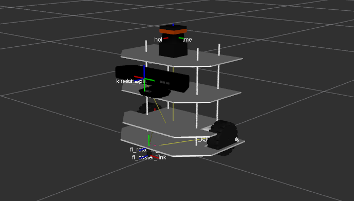

* To obtain [`sdf`](http://sdformat.org/spec) file format from the [`urdf`](http://wiki.ros.org/urdf) file:
```bash
gz sdf -p $(rospack find alpha_description)/robots/alpha_bot.urdf > $(rospack find alpha_gazebo)/models/alpha_robot/alpha_bot.sdf
```

## RViz visualization of Alpha


